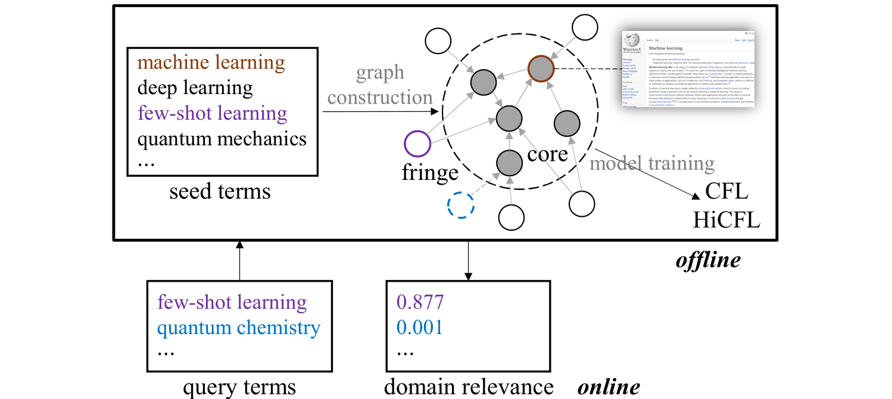
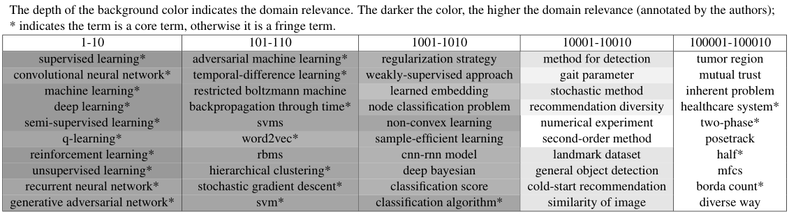

# README

The coda and data for "[Measuring Fine-Grained Domain Relevance of Terms: A Hierarchical Core-Fringe Approach](https://arxiv.org/abs/2105.13255)" (ACL '21)


## Introduction

We propose a hierarchical core-fringe learning framework to measure fine-grained domain relevance of terms – the degree that a term is relevant to a broad (e.g., computer science) or narrow (e.g., deep learning) domain.




## Requirements

See `requirements.txt`

To install *torch_geometric*, please follow the instruction on [pytorch_geometric](https://github.com/rusty1s/pytorch_geometric)


## Reproduction

> To produce results in the paper (using word2vec embeddings)


Download data from [Google Drive](https://drive.google.com/drive/folders/1wh4qQj5ALNjsIpwi_6UVO-qA86Epx7w3?usp=sharing), unzip and put all the folders in the root directory of this repo (details about data are described below)

For broad domains (e.g., CS)

```
python run.py --domain cs --method cfl
```

For narrow domains (e.g., ML)

```
python run.py --domain cs --method hicfl --narrow
```

For narrow domains (PU setting)  (e.g., ML)

```
python run.py --domain cs --method hicfl --narrow --pu
```

> All experiments are run on an NVIDIA Quadro RTX 5000 with 16GB of memory under the PyTorch framework. The training of CFL for the CS domain can finish in 1 minute.


## Query

> To handle user query (using compositional GloVe embeddings as an example)


Download data from [Google Drive](https://drive.google.com/drive/folders/1wh4qQj5ALNjsIpwi_6UVO-qA86Epx7w3?usp=sharing), unzip and put all the folders in the root directory of this repo

Download GloVe embeddings from https://nlp.stanford.edu/projects/glove/, save the file to `features/glove.6B.100d.txt`


Example:

```
python query.py --domain cs --method cfl
```

The first run will train a model and save the model to `model/`. For the follow-up queries, the trained model can be loaded for prediction.


> You can use the model either in a *transductive* or in an *inductive* setting (i.e., whether to include the query terms in training).


## Options

You can check out the other options available using:

```
python run.py --help
```


## Data

Data can be downloaded from [Google Drive](https://drive.google.com/drive/folders/1wh4qQj5ALNjsIpwi_6UVO-qA86Epx7w3?usp=sharing):

`term-candidates/`: list of seed terms. Format: `term <tab> frequency`

`features/`: features of terms (term embeddings trained by word2vec). To use compositional GloVe embeddings as features, you can download GloVe embeddings from https://nlp.stanford.edu/projects/glove/. To load the features, refer to `utils.py` for more details.

`wikipedia/`: Wikipedia search results for constructing the core-anchored semantic graph / automatic annotation

- `core-categories/`: categories of core terms collected from Wikipedia. Format: `term <tab> catogory <tab> ... category `

- `gold-subcategories/`: gold-subcategories for each domain collected from Wikipedia. Format: `level#Category`

- `ranking-results/`: Wikipedia search results. 0 means using *exact match*, 1 means without exact match. Format: `term <tab> result_1 <tab> ... result_k`.

  The results are collected by the following script:

  ```python
  # https://pypi.org/project/wikipedia/
  import wikipedia
  def get_wiki_search_result(term, mode=0):
      if mode==0:
          return wikipedia.search(f"\"{term}\"")
      else:
          return wikipedia.search(term)
  ```

`train-valid-test/`: train/valid/test split for evaluation with core terms

`manual-data/`: 

- `ml2000-test.csv`: manually created test set for ML 
- `domain-relevance-comparison-pairs.csv`: manually created test set for domain relevance comparison


## Term lists

Several term lists with domain relevance scores produced by CFL/HiCFL are available on `term-lists/`

Format:

```
term <tab> domain relevance score <tab> core/fringe
```

Sample results for *Machine Learning*:




## Citation

The details of this repo are described in the following paper. If you find this repo useful, please kindly cite it:

```
@inproceedings{huang2021measuring,
  title={Measuring Fine-Grained Domain Relevance of Terms: A Hierarchical Core-Fringe Approach},
  author={Huang, Jie and Chang, Kevin Chen-Chuan and Xiong, Jinjun and Hwu, Wen-mei},
  booktitle={Proceedings of ACL-IJCNLP},
  year={2021}
}
```

